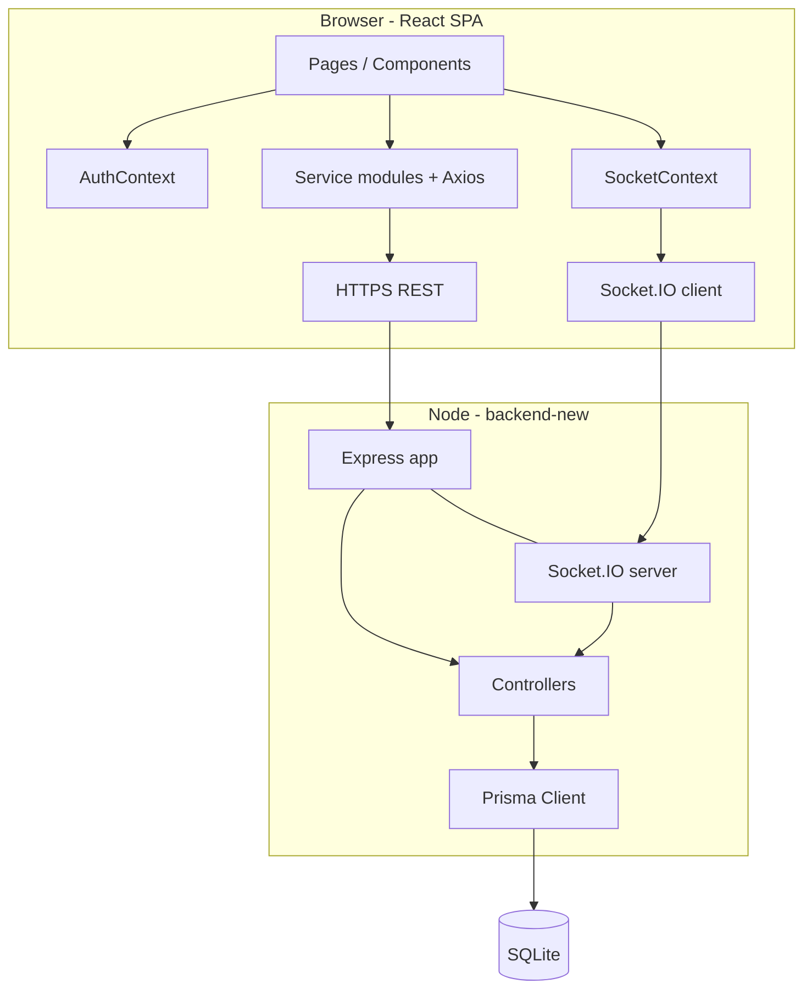

# 01 — Project Overview and Architecture

## What problem Sarthi solves

Students often need guidance choosing academic streams and careers. Sarthi connects them with **counselors** in one place: discovery, scheduling, messaging, assessments, peer community, and feedback after sessions.

## Roles

| Role | Primary goals in the app |
|------|---------------------------|
| **student** | Find counselors, book meetings, chat, community, aptitude test, rate after completed sessions |
| **counselor** | Publish availability, manage meeting requests, chat with students, build reputation via ratings |

There is **no admin role** in the current codebase. Moderation and analytics pages are placeholders in the sidebar.

## Tech stack (Sarthi 2.0)

| Layer | Choice | Why it matters in interviews |
|-------|--------|------------------------------|
| Frontend | React 18, Vite, React Router 6 | SPA with code-split lazy routes |
| HTTP client | Axios + interceptors | Auto attach JWT, silent refresh on 401 |
| Real-time | socket.io-client | Same origin as API; JWT in handshake |
| Backend | Express 4 (ES modules) | REST API + shared HTTP server with Socket.IO |
| ORM | Prisma 5 | Type-safe queries, migrations, schema as source of truth |
| Database | SQLite (`prisma/dev.db`) | Simple local dev; easy to swap provider in production |
| Auth | bcrypt, jsonwebtoken, httpOnly cookies | Password hashing + short-lived access + refresh rotation stored in DB |

Legacy folders `frontend/` and `backend/` (plain HTML + old Express/sqlite3) are **not** part of Sarthi 2.0.

## High-level architecture



Both REST and WebSockets attach to the **same HTTP server** (`http.createServer(app)` in `server.js`), which is the standard pattern for Socket.IO.

## Repository layout (what to memorize)

```
backend-new/
  prisma/schema.prisma     # Data model
  src/server.js            # Entry: CORS, routes, Socket.IO, error handler
  src/routes/*.routes.js   # URL mounting only
  src/controllers/*.js     # Business logic
  src/middleware/          # auth, validate, errorHandler
  src/services/            # Cross-cutting (notifications)
  src/socket/index.js      # Connection auth, rooms, emit helpers

frontend-new/
  src/main.jsx             # React root
  src/App.jsx              # Router + providers
  src/AppRoutes.jsx        # Lazy-loaded routes + ProtectedRoute
  src/context/             # Auth + Socket global state
  src/services/            # Thin API wrappers (one per domain)
  src/pages/               # Screen-level components
  src/components/          # Reusable UI + layout
```

**Pattern:** routes → controllers → Prisma. Frontend: pages → services → `api.js`.

## HTTP request lifecycle (typical protected API call)

1. Browser sends request to `http://localhost:5000/api/...` with header `Authorization: Bearer <accessToken>`.
2. Axios interceptor in `frontend-new/src/services/api.js` reads token from **in-memory** `tokenStore`.
3. `authenticate` middleware in `backend-new/src/middleware/auth.js` verifies JWT with `JWT_SECRET`, attaches `req.user = { id, email, role }`.
4. Route handler runs controller logic; Prisma reads/writes SQLite.
5. JSON response; on unhandled errors, `errorHandler` normalizes status and message.

If access token expired (15 minutes):

1. API returns 401.
2. Axios interceptor POSTs `/api/auth/refresh` with **cookies** (`withCredentials: true`).
3. Server validates refresh JWT + matches stored `User.refreshToken`.
4. New access token returned; original request retried.

## Environment variables

| Variable | Where | Purpose |
|----------|-------|---------|
| `DATABASE_URL` | backend | Prisma SQLite path, e.g. `file:./prisma/dev.db` |
| `JWT_SECRET` | backend | Sign/verify access tokens |
| `JWT_REFRESH_SECRET` | backend | Sign/verify refresh tokens |
| `PORT` | backend | Default 5000 |
| `CLIENT_URL` | backend | CORS + Socket.IO origin (default `http://localhost:5173`) |
| `NODE_ENV` | backend | `secure` cookie flag in production |
| `VITE_API_URL` | frontend | API base URL (default `http://localhost:5000`) |

## API surface (mount points)

All business APIs are under `/api/*` except health:

- `/api/health` — no auth
- `/api/auth` — register, login, refresh, logout, me
- `/api/users` — profiles
- `/api/counselors` — directory, detail, availability
- `/api/meetings` — CRUD-ish for bookings
- `/api/chats` — conversations and messages
- `/api/notifications` — inbox
- `/api/community` — posts, likes, comments
- `/api/aptitude` — questions, submit, history
- `/api/ratings` — reviews
- `/api/dashboard` — summary counts

## Design principles used in this codebase

1. **Thin routes, fat controllers** — easy to locate logic by domain file.
2. **Role checks inside controllers** — `authorize()` middleware exists but most routes use explicit `req.user.role` checks (be ready to discuss consolidating).
3. **Notifications as a service** — `createNotification()` both persists and pushes over Socket.IO.
4. **Chat: REST for persistence, Socket for fan-out** — messages always saved via POST; live UI updates via `chat:message` event.
5. **Lazy-loaded pages** — smaller initial bundle; `Suspense` + spinner fallback.

## Known gaps (honest roadmap talking points)

- No WebRTC / video sessions.
- Meeting times are **not** validated against counselor availability slots (slots are display + counselor workflow only).
- `express-rate-limit` is in `package.json` but **not wired** in `server.js` yet.
- Sidebar: Career Paths, Session Notes, Analytics — routes not implemented.
- `SessionNote` model exists in Prisma; no API/UI yet.
- Community post **edit** API exists; UI does not expose edit.
- Aptitude questions live **in code** (`aptitude.controller.js`), not in DB.

## Files to cite if asked “where is X?”

| Concern | File |
|---------|------|
| Server bootstrap | `backend-new/src/server.js` |
| JWT expiry | `backend-new/src/utils/jwt.js` (access 15m, refresh 7d) |
| Route map | `frontend-new/src/AppRoutes.jsx` |
| Global providers | `frontend-new/src/App.jsx` |
| DB schema | `backend-new/prisma/schema.prisma` |
