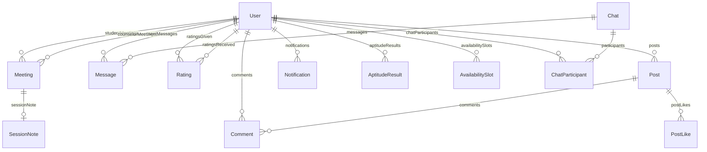

# 03 — Database and Data Model

Prisma schema: `backend-new/prisma/schema.prisma`  
Database file (dev): `backend-new/prisma/dev.db`  
Init: `npm run db:init` or Prisma migrations.

## Entity-relationship overview

## User (central table)

Single table for **both** students and counselors (`role: 'student' | 'counselor'`).

| Field | Notes |
|-------|--------|
| `name`, `email`, `password` | Core auth |
| `role` | Drives UI routes and server permissions |
| `stream`, `bio`, `gender`, `mobile` | Profile |
| `experience`, `specialization` | Counselor-oriented |
| `rating`, `totalRatings` | **Denormalized** from `Rating` aggregate for fast listing sort |
| `refreshToken` | Current refresh JWT string for session validation |

**Design choice:** one table vs separate Student/Counselor tables — simpler queries; nullable counselor fields for students.

## Meeting

Represents a **booking request / session**.

| Field | Notes |
|-------|--------|
| `date`, `startTime`, `endTime` | Stored as **strings** (not DateTime) — simple UI forms; sorting lexicographic if ISO-like `HH:mm` |
| `status` | `pending`, `accepted`, `rejected`, `completed`, `cancelled` |
| `topic`, `notes` | Optional student context |
| `meetingLink` | Reserved for future video link |

**Conflict rule:** cannot create meeting if same counselor + date + startTime already has status `pending` or `accepted`.

**Who can change status:**

- Counselor: `accepted`, `rejected`, `completed`, `cancelled` (owner of meeting).
- Student: only `cancelled` on own meeting.

## Chat and messaging

**Chat** — conversation container with `lastMessage`, `lastAt` for inbox sorting.

**ChatParticipant** — join table; unique `(chatId, userId)`.

**One-to-one chat logic:** `findSharedChat` loads all chats for user A, finds one with exactly two participants including user B. No group chats.

**Message** — `content`, `type` (default `text`), `isRead` for read receipts.

## Rating

| Constraint | Meaning |
|------------|---------|
| `@@unique([counselorId, studentId])` | One review per pair; updates overwrite via upsert |

**Business rule:** student must have at least one `Meeting` with `status: 'completed'` with that counselor.

After upsert, `recalculateCounselorRating` runs aggregate AVG/COUNT and updates `User.rating` and `User.totalRatings`.

## Community

**Post** — `title`, `content`, `category`, denormalized `likes` count.

**PostLike** — unique `(postId, userId)`; toggle updates both join row and counter in transaction.

**Comment** — belongs to post and user.

Delete post: transaction deletes comments, likes, then post.

## AvailabilitySlot

Weekly recurring windows: `dayOfWeek` 0–6, `startTime`/`endTime` as `"HH:mm"`.

Counselor save replaces **all** slots for that counselor (`deleteMany` + `createMany` in transaction).

## Notification

| `type` examples | When created |
|-----------------|--------------|
| `meeting_request` | Student books |
| `meeting_response` | Status change |
| `new_message` | Chat message to recipient |
| `rating` | Student rates counselor |
| `system` | Reserved |

`link` is a frontend path for the bell dropdown (`Link` in React).

## AptitudeResult

| Field | Notes |
|-------|--------|
| `scores` | JSON **string** in DB (`JSON.stringify` on write, parse on read) |
| `streamRecommendation` | Text recommendation from top category |
| `totalScore` | Sum of option scores |

Questions are **not** in DB — hardcoded array in controller.

## SessionNote

Linked 1:1 to `Meeting` (`meetingId` unique). Schema ready; **no controller/routes yet**.

## Prisma patterns you should explain

1. **`include` / `select`** — limit fields returned (avoid leaking passwords).
2. **`$transaction`** — atomic like toggle + counter, availability replace, post delete cascade.
3. **`upsert`** — ratings with composite unique key.
4. **`aggregate`** — `_avg`, `_count` for counselor rating.
5. **`findMany` + `distinct: ['studentId']`** — count unique students for counselor dashboard.

## SQLite specifics

- Good for demos and college projects; production might use PostgreSQL (change `provider` and `DATABASE_URL` only in Prisma).
- `contains` filters are case-sensitive depending on SQLite collation — worth noting if search feels inconsistent.

## Index and performance (interview)

Current schema relies on primary keys and uniques. At scale you would add indexes on:

- `Meeting(counselorId, date, status)`
- `Message(chatId, createdAt)`
- `Notification(userId, isRead)`

For this project size, Prisma defaults are sufficient.

## Data integrity stories

| Scenario | How app handles |
|----------|-----------------|
| Double booking same slot | 409 conflict on create |
| Rate without meeting | 403 |
| Non-participant reads chat | 403 on messages |
| Delete someone else's post | 403 |
| Duplicate email signup | 400 / Prisma P2002 → 409 in error handler |
