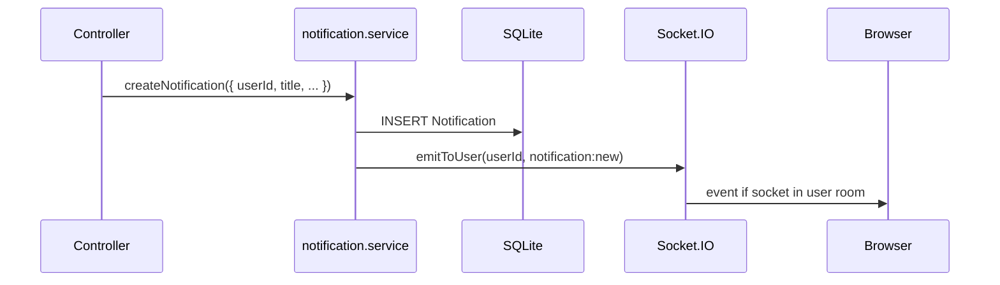

# 05 — Real-Time: Socket.IO and Notifications

**Primary file:** `backend-new/src/socket/index.js`  
**Client:** `frontend-new/src/context/SocketContext.jsx`, `pages/Messages.jsx`, `NotificationBell.jsx`

## Why two channels (REST + WebSocket)?

| Concern | Channel | Reason |
|---------|---------|--------|
| Persist messages, meetings, posts | REST + Prisma | Reliable, easy to retry, audit trail |
| Live UI updates, typing, presence | Socket.IO | Low latency broadcast to rooms |

**Rule in this project:** sending a chat message always goes through `POST /api/chats/:id/messages`. The controller saves to DB, then `emitToRoom('chat:{id}', 'chat:message', ...)`. Clients should not treat socket-only messages as source of truth.

## Server setup

1. `setupSocket(server)` called from `server.js` on the shared HTTP server.
2. CORS mirrors REST: `CLIENT_URL`, credentials.
3. Export helpers: `emitToUser`, `emitToRoom`, `getIO`.

## Connection authentication

```text
Client: io(url, { auth: { token: accessJWT }, withCredentials: true })
Server io.use: verifyAccessToken → socket.user = { id, email, role }
```

Unauthenticated sockets never reach `connection` handler.

## Rooms and events

### On connect

- Join **`user:{userId}`** — for user-targeted notifications.
- Broadcast **`presence:update`** `{ userId, status: 'online' }` to all clients.
- Track `onlineUsers` Map (socket id by user id) — server-side only.

### On disconnect

- Remove from map; emit **`presence:update`** `{ status: 'offline' }`.

### Chat room membership

Client emits **`chat:join`** with `chatId` and optional ack callback.

Server:

1. Verifies `ChatParticipant` for `(chatId, socket.user.id)`.
2. `socket.join('chat:' + chatId)`.
3. Ack `{ ok: true }` or error.

Client emits **`chat:leave`** on unmount when switching chats.

### Typing

Client emits **`chat:typing`** `{ chatId, isTyping }`.

Server verifies participant, then `socket.to('chat:' + chatId).emit('chat:typing', { chatId, userId, isTyping })`.

Note: uses `socket.to`, not `io.to`, so sender does not receive own typing event.

### Server → client chat events (from REST controllers)

| Event | Payload | When |
|-------|---------|------|
| `chat:message` | `{ message, chatId }` | After message saved |
| `chat:read` | `{ chatId, readerId }` | After PATCH read |

Emitted via `emitToRoom(\`chat:${chatId}\`, ...)`.

### Notifications

| Event | Payload | When |
|-------|---------|------|
| `notification:new` | `{ notification }` | After `createNotification()` |

Emitted via `emitToUser(userId, 'notification:new', ...)` to room **`user:{userId}`**.

## Notification pipeline (end-to-end)



**Triggers today:**

- Meeting created → counselor
- Meeting status updated → other party
- Chat message → each recipient
- Rating submitted → counselor

Meeting notifications are **both** stored and pushed. User can see history in bell even if offline; live increment if online.

## Frontend: SocketProvider

- Connects when `isAuthenticated && accessToken`.
- Reconnects when token changes (effect dependency).
- Maintains `onlineUsers` map from `presence:update`.
- Disconnect cleanup on logout.

Socket URL: same as API (`VITE_API_URL` or localhost:5000).

## Frontend: Messages page

1. Load chats REST.
2. Select chat → load messages REST → `markRead` REST → `socket.emit('chat:join', chatId)`.
3. Listen `chat:message` — update list and active thread if matching id; dedupe by message id.
4. Listen `chat:typing` — show indicator for other user.
5. Listen `chat:read` — optional UI update for read state.
6. Send: **`chatService.send`** (POST) only — not pure socket send.
7. Typing: debounced socket emit on input change.

Deep link: `?chatId=` in URL via `useSearchParams` (used from notification links).

## Frontend: NotificationBell

1. Initial load `GET /api/notifications`.
2. Subscribe `notification:new` — prepend to list, bump unread count.
3. Mark all read → PATCH + local state update.

## Interview diagram: one chat message

```text
Student clicks Send
  → POST /api/chats/3/messages { content }
  → DB insert Message, update Chat.lastMessage
  → io.to('chat:3').emit('chat:message', ...)
  → createNotification for counselor
  → io.to('user:7').emit('notification:new', ...)
Counselor Messages tab (if joined chat:3) updates instantly
Counselor bell increments if panel closed
```

## Failure modes to discuss

| Issue | Behavior |
|-------|----------|
| Socket disconnected | Messages still saved; user sees them on refresh or reconnect + reload |
| Access token expired mid-session | REST refresh retry; socket may need reconnect with new token |
| User not in chat room | Still gets notification; message appears on next open |
| Multiple tabs | Each tab may join same rooms; duplicate UI updates possible (dedupe by id mitigates messages) |

## Scaling notes (beyond project scope)

- Single Node process — fine for demo.
- Production: Redis adapter for Socket.IO multi-instance, sticky sessions, separate notification queue for email push.

## Legacy Sarthi pitfall (good contrast)

Old codebase mixed raw WebSocket, Socket.IO event names, and inline handlers. Sarthi 2.0 **standardizes** on Socket.IO with documented event names and REST persistence — mention this if asked about refactoring experience.
